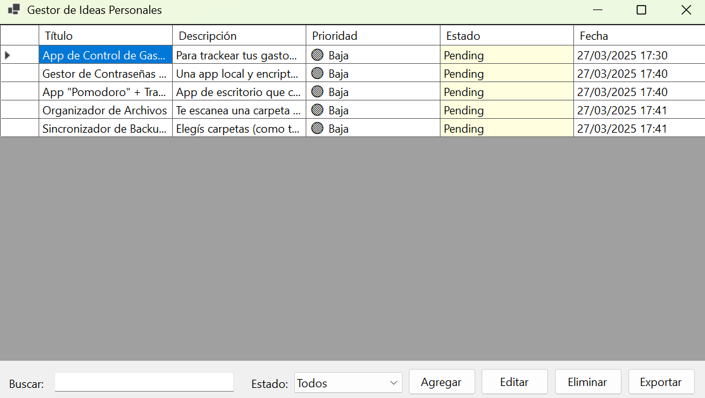

# 📌 Gestor de Ideas Personales

**Gestor de Ideas Personales** es una aplicación de escritorio moderna desarrollada en **C#** usando **Windows Forms (.NET 6/7/8)**.  
Está diseñada para ayudarte a organizar, gestionar y hacer seguimiento de tus ideas, proyectos y tareas personales de forma eficiente y visual.

---

## ✨ Funcionalidades Principales

- ✅ **Agregar, editar y eliminar ideas**
- 🧾 Campos personalizados: `Título`, `Descripción`, `Prioridad`, `Estado`, `Tags`
- 🔍 **Búsqueda en tiempo real** por texto
- 🧠 **Filtro por estado**: `Pending`, `InProgress`, `Completed`
- 🖥️ **UI Adaptable**: pantalla completa y responsive
- 🧩 **Visualizaciones inteligentes**:
  - Colores por estado y prioridad
  - Doble clic en fila para ver detalles completos
- 💾 **Almacenamiento local con JSON**
- 💾 **Creación automática de backups**
- 📤 **Exportación a `.txt`, `.csv`, `.md`**

---

## 📤 Exportaciones

- 📄 Exportación de ideas a `.txt` (texto plano)
- 📊 Exportación a `.csv` compatible con Excel
- 📘 Exportación a `.md` para integración con GitHub, Notion, etc.
- ⚙️ Selección del tipo de exportación con `SaveFileDialog`

---

## 📦 Tecnologías Utilizadas

| Tecnología      | Uso                                      |
|-----------------|-------------------------------------------|
| **C# / .NET 6+** | Lenguaje principal y base del proyecto   |
| **Windows Forms** | UI de escritorio, rápida y flexible     |
| **JSON**         | Almacenamiento local de datos            |
| **LINQ**         | Filtrado y manipulación de listas        |

---

## 🖼️ Captura de Pantalla

